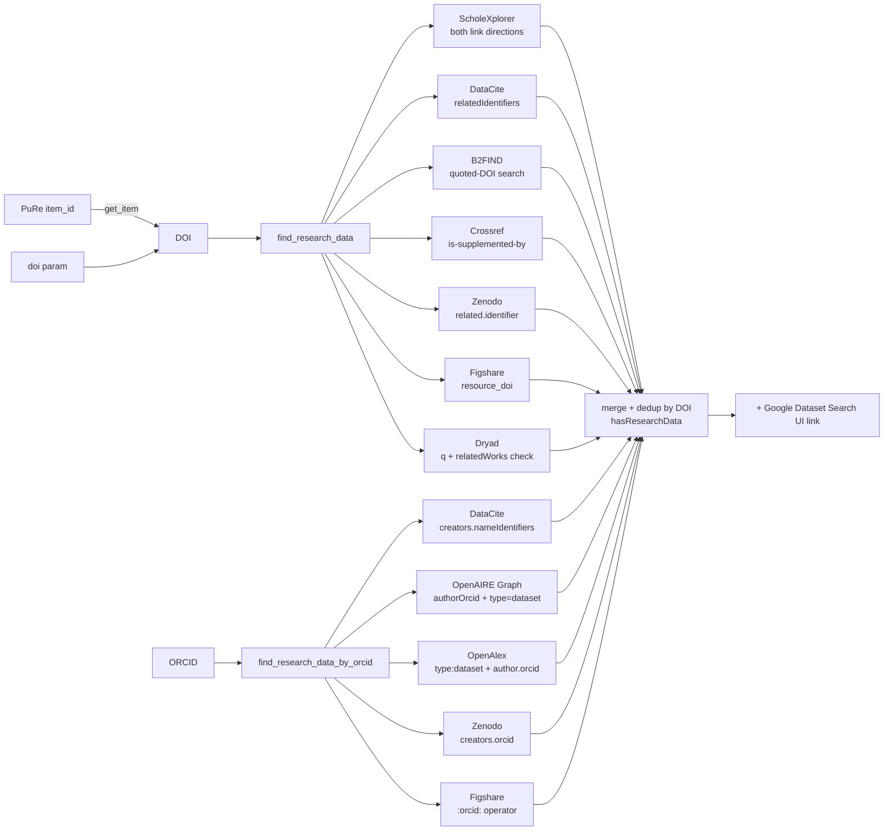

# Research-Data Discovery: API Capabilities

Goal: given a **publication DOI** (from PuRe) or a researcher **ORCID**, find out
whether research data (datasets) exist.

All findings below were verified with live requests on 2026-07-15.
All integrated services are free and need no authentication.

## Capability matrix

| Service | DOI → datasets | ORCID → datasets | Auth | Rate limit | Verdict |
|---|---|---|---|---|---|
| [ScholeXplorer](https://api.scholexplorer.openaire.eu) (OpenAIRE/Scholix) | **yes** — native link resolver | no | none | none observed | **integrated** — primary DOI path |
| [DataCite](https://api.datacite.org) | **yes** — `relatedIdentifiers` query | **yes** — `creators.nameIdentifiers` | none | generous | **integrated** |
| [OpenAIRE Graph](https://api.openaire.eu/graph/v1) | no (relations live in ScholeXplorer) | **yes** — `authorOrcid` | none | 7 199/h anon | **integrated** — ORCID path |
| [B2FIND](https://b2find.eudat.eu) (EUDAT, CKAN) | **yes** — quoted-DOI full-text (hits indexed `RelatedIdentifier`) | no | none | none observed | **integrated** |
| [Crossref](https://api.crossref.org) `relation` | partial — `is-supplemented-by`, publisher-dependent | no (no datasets registered) | none (polite pool) | polite | **integrated** — cheap pre-check |
| [OpenAlex](https://api.openalex.org) | no (`related_works` is similarity, not supplements) | **yes** — `type:dataset` + author ORCID filter | none (`mailto`) | ~10 rps | **integrated** — best ORCID aggregation |
| [Zenodo](https://zenodo.org/api/records) | **yes** — `related.identifier` | **yes** — `creators.orcid` | none | 30/min anon | **integrated** |
| [Figshare](https://api.figshare.com/v2) | **yes** — `resource_doi` exact match (PLOS supplements) | **yes** — `:orcid:` search operator | none | be polite | **integrated** |
| [Dryad](https://datadryad.org/api/v2) | **yes** — `q` search, verified via `relatedWorks` | no | none | none observed | **integrated** (DOI only) |
| [Google Dataset Search](https://datasetsearch.research.google.com) | UI only | UI only | — | — | **no public API** — we return a UI search link |
| OSF (api.osf.io) | no | no | — | — | skip — no usable lookup in either direction |
| re3data | n/a (repository registry, not datasets) | n/a | none | — | skip — metadata about repositories only |
| BASE (base-search.net) | untestable | untestable | **IP whitelist** required | — | skip (whitelisting possible for DE academia) |
| CORE (api.core.ac.uk) | weak dataset typing | no | anon ok | 10/window | skip |

## How the MCP tools fan out



## Verified example queries

### ScholeXplorer (Scholix links; this *is* OpenAIRE's DOI↔dataset link service)

Links must be queried in **both directions** — a `IsSupplementTo` link deposited by
the data repository is only visible with the article as *target*:

```
GET https://api.scholexplorer.openaire.eu/v2/Links?sourcePid={doi}&targetType=dataset
GET https://api.scholexplorer.openaire.eu/v2/Links?targetPid={doi}&sourceType=dataset
```

Verified: `targetPid=10.1016/j.quascirev.2014.09.022&sourceType=dataset` → 1
`IsSupplementTo` dataset that is invisible from the `sourcePid` direction.
v2 and v3 paths return identical Scholix JSON (`totalLinks`, `result[]` with
`RelationshipType.Name`, `source`/`target` `{Identifier[], Title, Type, Publisher}`).

### DataCite

```
GET https://api.datacite.org/dois?query=relatedIdentifiers.relatedIdentifier:"{doi}"&resource-type-id=dataset
GET https://api.datacite.org/dois?query=creators.nameIdentifiers.nameIdentifier:"https://orcid.org/{orcid}"&resource-type-id=dataset
```

Verified: article `10.1159/000553587` → 2 supplement datasets; ORCID
`0000-0003-1419-2405` → 31 datasets. This is the same index behind
[DataCite Commons](https://commons.datacite.org/).

### OpenAIRE Graph API v1

```
GET https://api.openaire.eu/graph/v1/researchProducts?authorOrcid={orcid}&type=dataset
```

Verified: 18 datasets for the ORCID above. Anonymous rate limit from response
headers: `x-ratelimit-limit: 7199`/hour. The Graph API cannot traverse
publication→dataset relations by DOI — that job belongs to ScholeXplorer.
The [explore.openaire.eu](https://explore.openaire.eu) UI sits on this graph.

### B2FIND (CKAN)

```
GET https://b2find.eudat.eu/api/3/action/package_search?q="{doi}"
```

Verified: quoted DOI `10.1594/pangaea.867908` → 13 packages (DOI matches the
indexed `DOI`/`RelatedIdentifier` extras). Package extras carry `DOI`,
`RelatedIdentifier`, `Publisher`, `PublicationYear`, `Discipline`.

### Crossref relation (cheap pre-check)

```
GET https://api.crossref.org/works/{doi}   → message.relation["is-supplemented-by"]
```

~98 k works carry `is-supplemented-by`; coverage is publisher-dependent
(IUCr/Copernicus deposit it, PLOS does not). One free GET — worth it, never sufficient alone.

### Zenodo / Figshare / Dryad / OpenAlex

```
GET https://zenodo.org/api/records?q=related.identifier:"{doi}"&type=dataset
GET https://zenodo.org/api/records?q=creators.orcid:"{orcid}"&type=dataset
GET https://api.figshare.com/v2/articles?resource_doi={doi}
POST https://api.figshare.com/v2/articles/search  {"search_for": ":orcid: {orcid}", "item_type": 3}
GET https://datadryad.org/api/v2/search?q="{doi}"          (verify hit via relatedWorks)
GET https://api.openalex.org/works?filter=type:dataset,authorships.author.orcid:{orcid}
```

All verified live. Figshare `resource_doi` is how PLOS supplementary items link
back to the article. Dryad results are kept only when their `relatedWorks`
actually reference the queried DOI.

### Google Dataset Search

No public API exists (Google offers none; the service indexes schema.org/Dataset
markup). The tools return a prefilled UI link instead:
`https://datasetsearch.research.google.com/search?query={doi or name}`.

## Notes

- DOI coverage differs per source: ScholeXplorer aggregates DataCite + Crossref +
  repository feeds, but each source also has exclusive links — hence the fan-out.
- ~90 % of our users search in German, but all these APIs are keyed on
  identifiers (DOI/ORCID), so language is irrelevant here.
- ORCID is accepted bare (`0000-0003-1419-2405`) or as URL; providers get the
  form they index.
